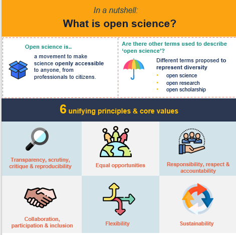

### The workshop is conducted in person, facilitating collaborative learning and interactive participation in small teams.

------------------------------------------------------------------------

<To be updated>
